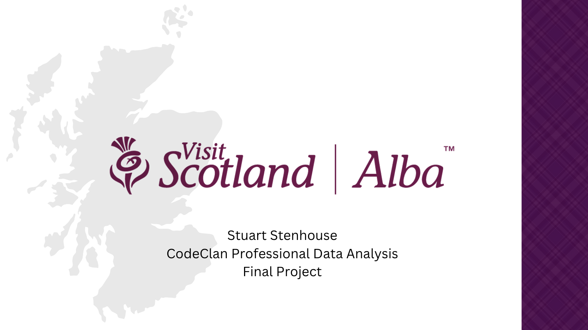

# Visit Scotland Project

------------------------------------------------------------------------

## Introduction

This project was completed over 10 days in June 2023 as part of the
CodeClan Professional Data Analysis Course.

------------------------------------------------------------------------

## Aim

To improve understanding of tourism data for Scotland in order to
support efforts towards maximising the countries tourism assets.

Key questions considered were:

-   How have tourism rates changed over time?
-   When looking at regional tourism, what insights can we gain?
-   Where are our visitors from? Do they differ in the money the spend
    or number of visits?
-   Can we predict spending and visits?

To answer these questions, 3x Key Performance Indicators were
identified:

1.  Number of Visits
2.  Expenditure
3.  Expenditure per Visit

------------------------------------------------------------------------

## Ethics

The data used is, to varying extents, aggregated before being made openly available. Individual survey responses are not made available and there were no ethical concerns regarding privacy and confidentiality.

------------------------------------------------------------------------

## Code Summary

### Cleaning Script: `cleaning_script.R`

The cleaning script reads in the raw data from `data/raw_data`, performs a variety of wrangling and cleaning operations and writes the cleaned data to `data/clean_data` in .csv format ready to be read in by the analysis notebook `visit_scotland_analysis.Rmd`.

### Analysis Notebook: `visit_scotland_analysis.Rmd`

The analysis notebook contains the workings of all statistical analysis and visualisation used in the project presentation.

------------------------------------------------------------------------

### Assumptions / Personal Judgements:

- Due to the impact of COVID-19 on tourism and data collection and the changes in methodoligies applied to collected data, I chose to include data only up until and including 2019 in the analysis.

- Taking into consideration allocated preparation and presentation time, I have also chosen to focus on overnight tourism only and the analysis does not consider day visits.

------------------------------------------------------------------------

## Conclusions

TBC

------------------------------------------------------------------------

## Key Skills / Technologies Used

**Skills** 

- Exploratory Data Analysis 
- Data Visualisation 
- Geospatial Analysis 
- Linear Regression 
- Hypothesis Testing 
- Data Wrangling 
- Data Cleaning

**Languages** 

- R 
- RMarkdown

**Packages** 

- Tidyverse 
- modelr 
- sf 
- infer 
- Janitor
- here 
- ggridges 
- skimr
- ggfortify

**Technlogoies** 

- Git 
- GitHub

------------------------------------------------------------------------