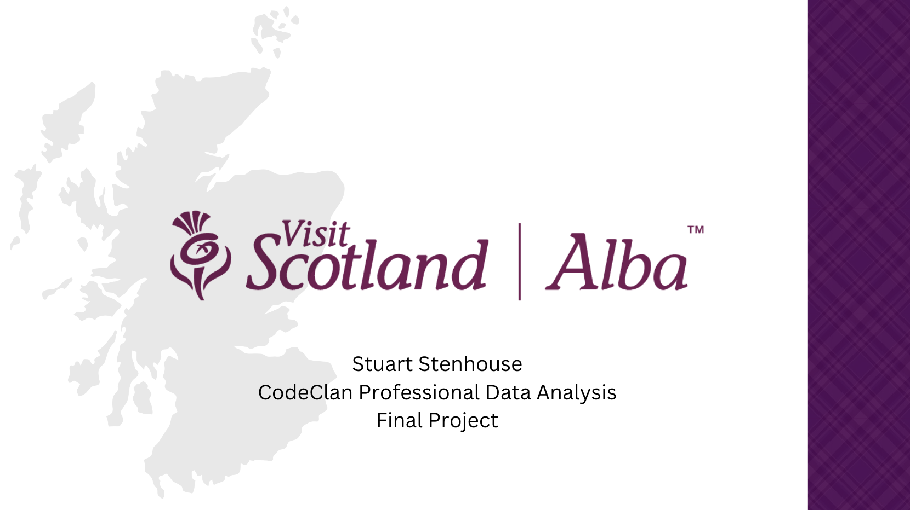
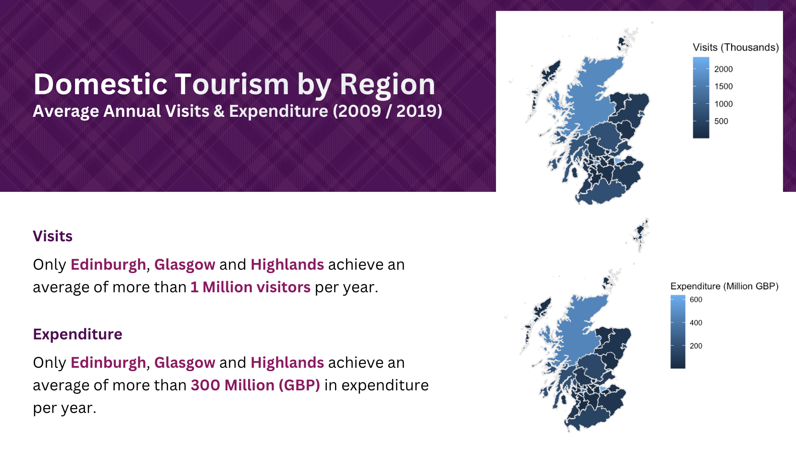
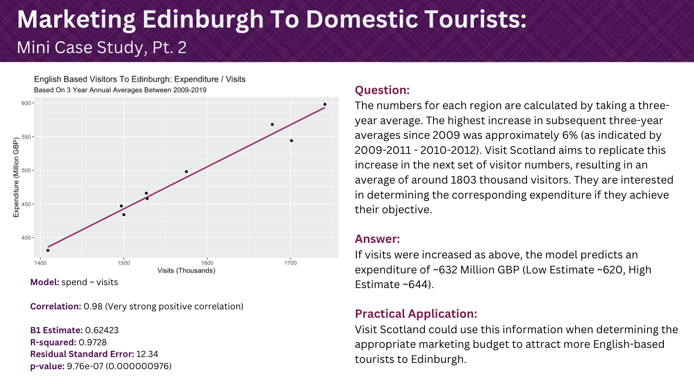

## Introduction

This project was completed over 10 days in June 2023 as part of the
CodeClan Professional Data Analysis Course.

------------------------------------------------------------------------

## Aim

To improve understanding of tourism data for Scotland in order to
support efforts towards maximising the countries tourism assets.

Key questions considered were:

-   How have tourism rates changed over time?
-   When looking at regional tourism, what insights can we gain?
-   Where are our visitors from? Do they differ in the money the spend
    or number of visits?
-   Can we predict spending and visits?

To answer these questions, 3x Key Performance Indicators were
identified:

1.  Number of Visits
2.  Expenditure
3.  Expenditure per Visit

------------------------------------------------------------------------

## Screenshots

------------------------------------------------------------------------

## Code Summary

### Cleaning Script: `cleaning_script.R`

The cleaning script reads in the raw data from `data/raw_data`, performs
a variety of wrangling and cleaning operations and writes the cleaned
data to `data/clean_data` in .csv format ready to be read in by the
analysis notebook `visit_scotland_analysis.Rmd`.

### Analysis Notebook: `visit_scotland_analysis.Rmd`

The analysis notebook contains the workings of all statistical analysis
and visualisation used in the project presentation.

------------------------------------------------------------------------

### Assumptions / Personal Judgements:

-   Due to the impact of COVID-19 and given the limited time frame for analysis and presentation, I decided to narrow my focus to data up until and including 2019.

-   In light of the limited time frame for analysis and presentation, I narrowed my focus to data about overnight visits for this project.

------------------------------------------------------------------------

## Conclusions

**How have tourism rates changed over time?**

- The overall trend in domestic and international visitor numbers is stable, but there have been recent rises in domestic visitors and declines in international visitors.
- Both domestic and international expenditure has increased, with international spending rising at a greater rate.

**When looking at regional tourism, what insights can we gain?**

- Edinburgh, Glasgow and the Highlands have the highest average visitor numbers and expenditure.
- the Shetland Islands, Orkney Islands and Na h-Eileanan Siar have the highest expenditure per visit, with longer average stays per visit than other regions, a potential factor.
- Edinburgh consistently returns the highest Gross Value Added.

**Where are our visitors from? Do they differ in the money the spend or number of visits?**

- International visitors make up 18% of visits but 39% of expenditure.
- The USA makes up the most visits and the highest level of expenditure.
- Canada, Australia and China have the highest spend per visit outside the USA.

In addition, my analysis has demonstrated methods for building on these insights to inform data driven decision making in line with Visit Scotland's objectives. This was achieved by using two mini case studies.

1.  Mini Case Study 1: Increasing English Based Visitors to Edinburgh

Insights identified that the number of English-based visitors to Edinburgh was greater than the number of Scottish-based visitors. English based visitors also had a greater expenditure per visit and longer length of stay. To build on these insights, Linear Regression was used to demonstrate how spending could be predicted and used to inform marketing budget allocation for a campaign to increase English-based visitors to Edinburgh.

2.  Mini Case Study 2: Maximising the Economic Benefit of a Campaign to Attract Canadian Based Visitors

Insights identified that Canada had a relatively low number of visits to Scotland but a relatively high expenditure per visit. To build on these insights, hypothesis testing was used to identify a statistically significant difference in the spend per visit of Canadian-based visitors to Scotland based on the season. This could then be used to support data-driven decision-making on marketing direction if Visit Scotland wished to increase the number of Canadian-based visitors to Scotland. For example, by targeting increased visits during the season where spend-per-visit is greatest.

------------------------------------------------------------------------

## Key Skills / Technologies Used

**Skills**

-   Exploratory Data Analysis
-   Data Visualisation
-   Geospatial Analysis
-   Linear Regression
-   Hypothesis Testing
-   Data Wrangling
-   Data Cleaning

**Languages**

-   R
-   RMarkdown

**Packages**

-   Tidyverse
-   modelr
-   sf
-   infer
-   Janitor
-   here
-   ggridges
-   skimr
-   ggfortify

**Technlogoies**

-   Git
-   GitHub

------------------------------------------------------------------------

## Ethics

The data used is, to varying extents, aggregated before being made
openly available. Individual survey responses are not made available and
there were no ethical concerns regarding privacy and confidentiality.
